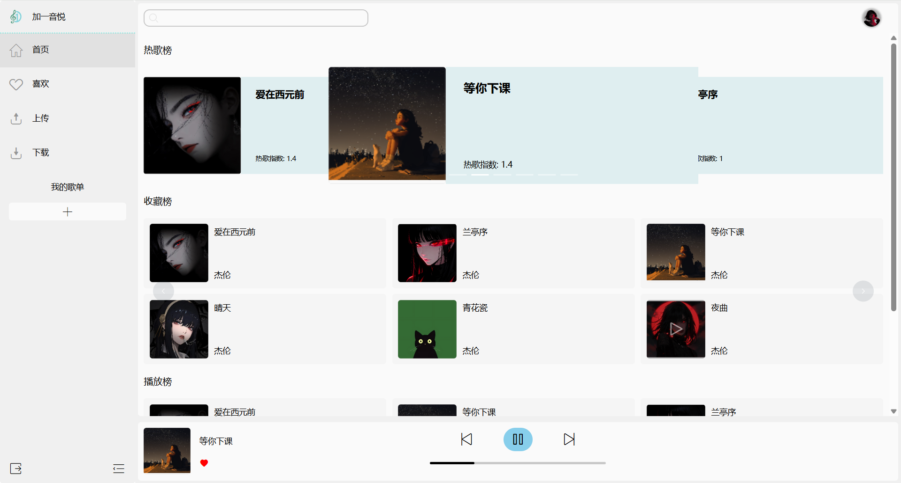
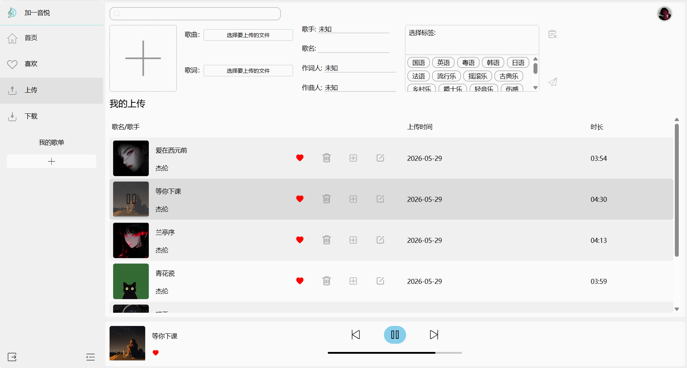

# 加一音悦

一个现代化的音乐平台，提供音乐上传、播放、管理等功能。(目前已经实现基础功能)
需要先上传歌曲才能看到效果

## 项目效果


## 项目结构

```
加一音悦/
├── JiaYi-Music/           # 后端服务
│   ├── jy-common/         # 公共模块（工具类、常量、异常处理）
│   ├── jy-security/       # 安全模块（认证、授权、JWT）
│   └── jy-server/         # 主服务（业务逻辑、控制器）
├── JiaYi-Music-ui/        # 前端应用
│   └── src/
│       ├── components/     # 公共组件
│       ├── views/          # 页面视图
│       ├── router/         # 路由配置
│       ├── store/          # 状态管理
│       └── api/            # API接口
└── README.md
```

## 技术栈

### 后端

| 技术          | 版本     | 说明       |
|-------------|--------|----------|
| Java        | 17     | 编程语言     |
| Spring Boot | 3.2.x  | 应用框架     |
| MyBatis     | 3.5.x  | ORM框架    |
| MySQL       | 8.0+   | 数据库      |
| Redis       | 7.0+   | 缓存       |
| Redisson    | 3.23.x | Redis客户端 |
| JWT         | 0.12.x | 身份认证     |

### 前端

| 技术           | 版本     | 说明      |
|--------------|--------|---------|
| Vue          | 3.5.x  | 前端框架    |
| Vite         | 7.2.x  | 构建工具    |
| Element Plus | 2.13.x | UI组件库   |
| Arco Design  | 2.57.x | UI组件库   |
| Pinia        | 3.0.x  | 状态管理    |
| Vue Router   | 4.6.x  | 路由管理    |
| Axios        | 1.13.x | HTTP客户端 |

## 快速开始

### 环境要求

- JDK 17+
- Node.js 20+
- MySQL 8.0+
- Redis 7.0+(需要包含布隆过滤器插件)
- Maven 3.9+

### 后端部署

1. **配置数据库**

建立数据库jy_music然后运行table.sql即可

2. **修改配置文件**

编辑 `JiaYi-Music/jy-server/src/main/resources/application.yml`：

- 配置MySQL连接信息
- 配置Redis连接信息
- 配置文件存储路径

3. **运行后端服务**
maven依赖安装完成后运行JiaYiApplication类即可

### 前端部署

1. **安装依赖**

```bash
cd JiaYi-Music-ui
pnpm install
```

2. **开发模式运行**

```bash
pnpm run dev
```

## API接口

### 用户模块

- `POST /api/user/login` - 用户登录
- `POST /api/user/register` - 用户注册
- `GET /api/user/info` - 获取用户信息
- `PUT /api/user/info` - 更新用户信息

### 歌曲模块

- `GET /api/song/list` - 获取歌曲列表
- `GET /api/song/{id}` - 获取歌曲详情
- `POST /api/song` - 上传歌曲
- `PUT /api/song/{id}` - 更新歌曲信息
- `DELETE /api/song/{id}` - 删除歌曲

### 分类模块

- `GET /api/category/list` - 获取分类列表
- `POST /api/category` - 创建分类

## 核心功能

1. **用户认证** - JWT令牌认证，支持登录、注册、密码重置
2. **音乐上传** - 支持大文件分片上传
3. **音乐播放** - WebSocket实时通信，支持在线播放
4. **歌单管理** - 创建、编辑、删除歌单
5. **收藏功能** - 收藏歌曲、歌单
6. **下载管理** - 管理已下载的音乐

## 项目特点

- **模块化架构** - 后端采用微服务模块化设计
- **安全认证** - JWT + 验证码 + 密码锁定机制
- **文件上传** - 支持分片上传，断点续传
- **实时通信** - WebSocket实现实时播放状态同步

## 目录说明

```
JiaYi-Music/
├── jy-common/              # 公共模块
│   ├── src/main/java/com/jy/
│   │   ├── cache/          # 缓存服务
│   │   ├── constant/       # 常量定义
│   │   ├── domain/         # 数据模型
│   │   ├── exception/      # 异常处理
│   │   └── utils/          # 工具类

├── jy-security/            # 安全模块
│   ├── src/main/java/com/jy/
│   │   ├── config/         # 安全配置
│   │   ├── filter/         # 过滤器
│   │   ├── service/        # 安全服务
│   │   └── securityUtils/  # 安全工具

└── jy-server/              # 主服务
    ├── src/main/java/com/jy/
    │   ├── controller/     # REST控制器
    │   ├── service/        # 业务服务
    │   ├── mapper/         # 数据访问层
    │   ├── config/         # 应用配置
    │   └── aop/            # AOP切面
    └── src/main/resources/
        ├── mapper/         # MyBatis映射文件
        └── application.yml # 应用配置
```

## 许可证

MIT License
